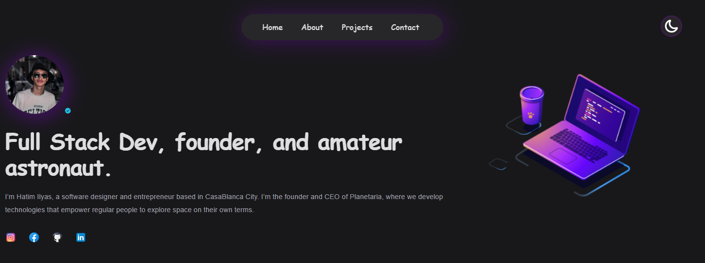
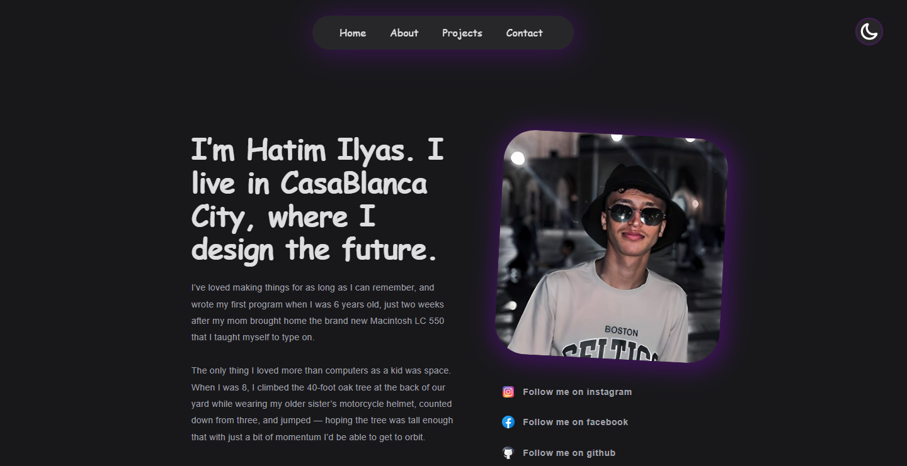
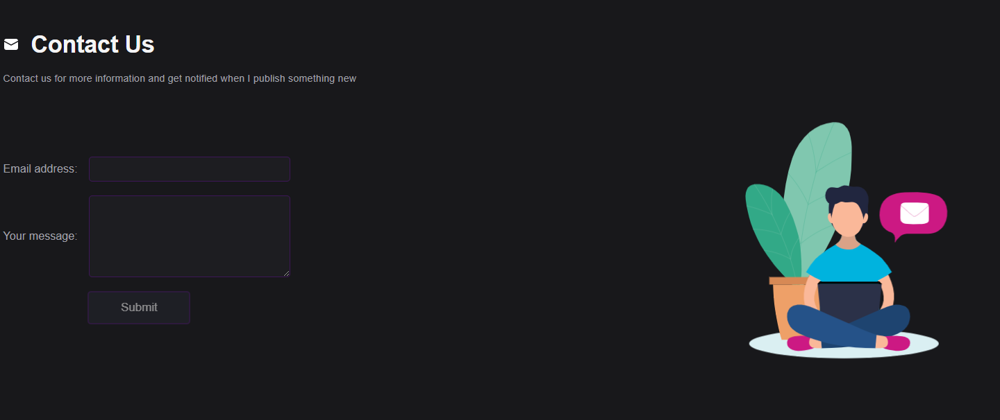
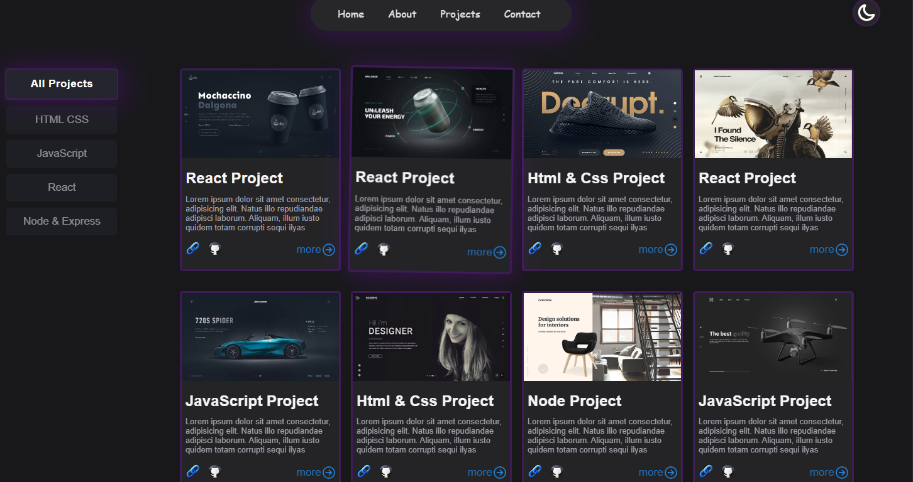

# HATIM ILYAS Portfolio

A visually stunning portfolio showcasing projects, skills, and achievements. Built with React, styled-components, and Vite for a fast and smooth experience.

## 🚀 Features

- Modern Design: Present your projects elegantly with a sleek and modern UI.
- Responsive Layout: Ensures seamless access on various devices and screen sizes.
- Interactive Components: Engage visitors with interactive elements and smooth transitions.
- Fast Performance: Optimized for speed and performance using Vite.
- CHI 7AJA HRBAANA

## 🛠️ Technologies Used

- React
- styled-components
- Vite
- JavaScript (ES6+)

## 📸 Screenshots
Here are some screenshots of the portfolio:

<div style="margin-top: 20px; display: flex; flex-wrap: wrap; justify-content: space-between;">
  
  
  
  
</div>

## 📦 Installation

Clone the repository:

```bash
git clone https://github.com/HatimIlyas04/PORTFOLIO-Hatim
Navigate to the project directory:

bash
Copy code
cd portfolio
Install dependencies:

bash
Copy code
npm install
Start the development server:

bash
Copy code
npm run dev
Open your browser and visit http://localhost:3000 to view the portfolio.

📝 Feedback
If you have any feedback or suggestions, feel free to open an issue or reach out to me.

📄 License
This project is licensed under the MIT License. Feel free to use and modify it for your own projects.
